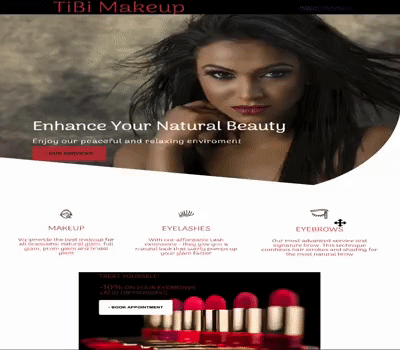
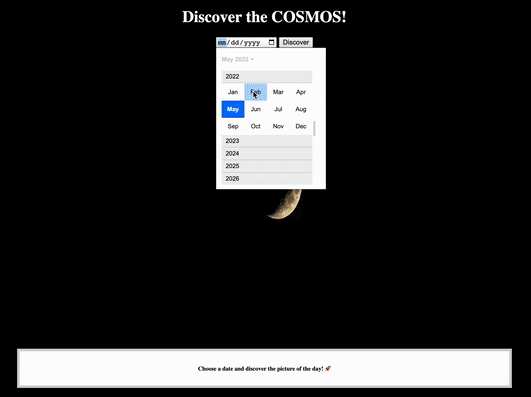

<h1 align="center">Hi, I'm Patricia</h1>
<h3 align="center">A passionate Full-Stack Software Developer based in New York City.</h3>

- 🌱 I’m currently learning **MERN Stack**

<!-- - 👩🏽‍💻  My portfolio https://devpatricia.netlify.app/ -->

- 💞️ I'm looking to collaborate on open source.

- 📫 How to reach me **devpatriciad@gmail.com** 

- ⚡ Fun fact: I trade options

<h4 align="left">Connect with me</h4>

<h4 align="left">Technologies</h4>

    
    
    
    
     
    
     
    
    
<h1 align="center">Latest Projects</h1>
<table bordercolor="#66b2b2">
  
  <tr>
    <td width="50%" valign="top">
      <h3 align="center">TiBi Makeup</h3>
         
        
         
        <strong>HTML & CSS </strong> 
Resposive website for a local makeup studio.

      </td>
      <td width="50%" valign="top">
      <h3 align="center">Discover the COSMOS!</h3>
         
        
         
        <strong> HTML, CSS & JavaScript </strong> 
 Pictures from the NASA API. Discover the picture of the day or you can choose an specific date. 

      </td>
    </tr>
